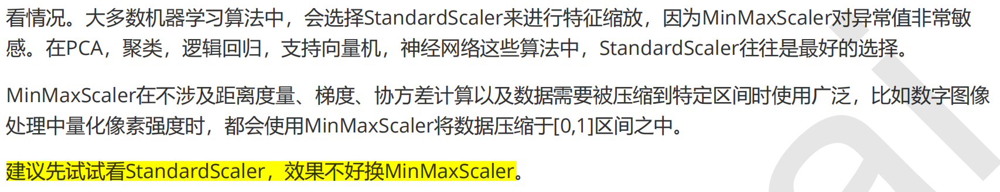
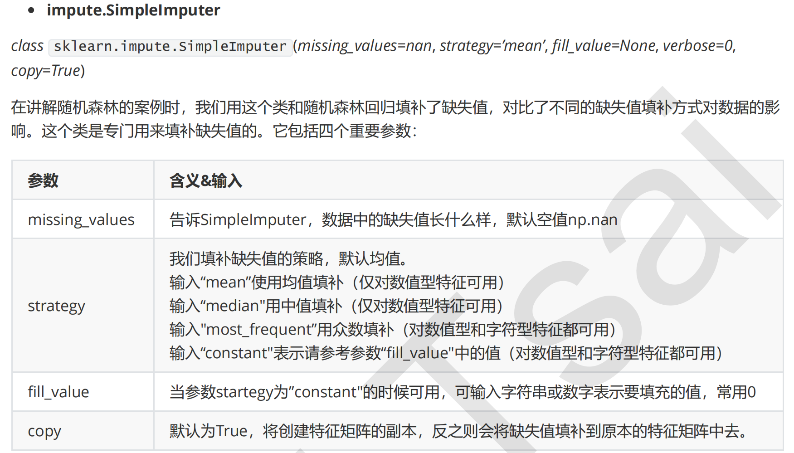
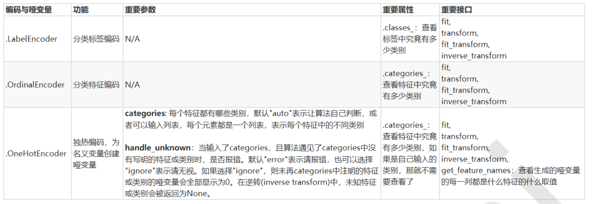
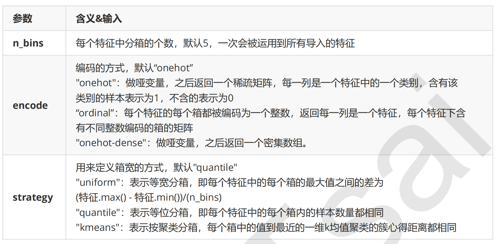
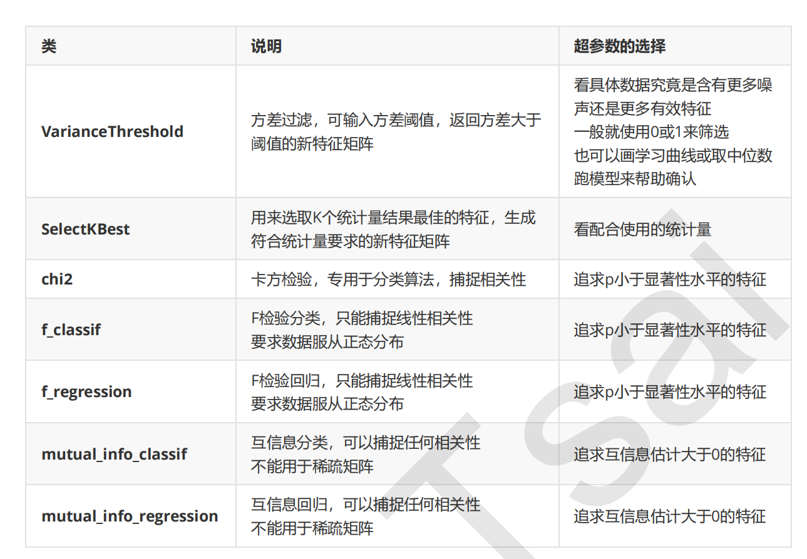
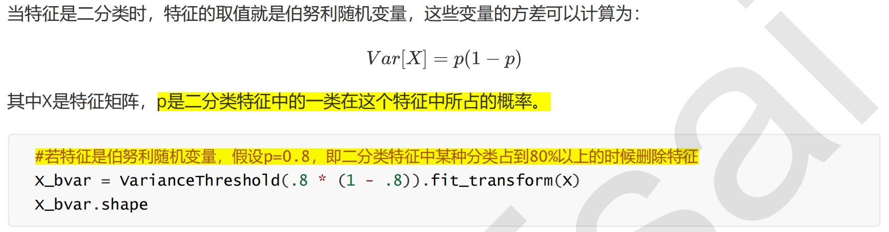
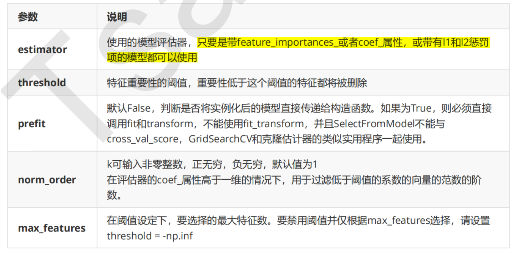
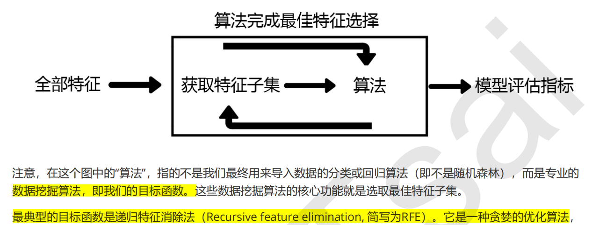
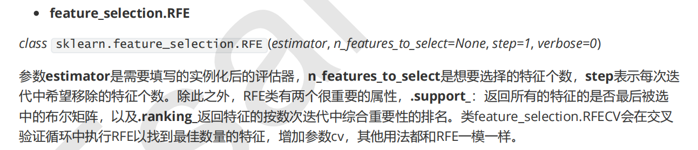

## 1. 数据预处理

### 1.1 异常值处理

- 箱线法：适用于大部分数据

- 拉以达准则：假设一组检测数据只含有随机误差，对其进行计算处理得到标准偏差，按一定概率确定一个区间，认为凡超过这个区间的误差，就不属于随机误差而是粗大误差，含有该误差的数据应予以剔除

  适用于数据量大，服从或近似服从正态分布的数据。

  误差范围可取$3\sigma$（$3\sigma$原则）


### 1.2 数据无量纲化（归一化or标准化）

线性的无量纲化包括**中心化**（Zero-centered或者Mean-subtraction）处理和**缩放处理**（Scale）。中心化的本质是让所有记录减去一个固定值，即让数据样本数据平移到某个位置。缩放的本质是通过除以一个固定值，将数据固定在某个范围之中，取对数也算是一种缩放处理

- ##### 数据归一化（python库：**preprocessing.MinMaxScaler**）

  当数据(x)按照最小值中心化后，再按极差（最大值 - 最小值）缩放，数据移动了最小值个单位，并且会被收敛到[0,1]之间，而这个过程，就叫做**数据归一化**(Normalization，又称Min-Max Scaling)。归一化后的数据服从正态分布
  $$
  x^*=\frac{x-min(x)}{max(x)-min(x)}
  $$

  - feature_range: 控制我们希望把数据压缩到的范围，默认是[0, 1]
  - 当x中的特征数量非常多是，fit会报错，并表示数据量太大我计算不了。此时应使用partial_fit作为训练接口
  - 数据归一化另一种实现（BONUS：使用numpy来实现）

  ```python
  X_nor = (X - X.min(axis=0)) / (X.max(axis=0)) - X.min(axis=0)
  ```

- ##### 数据标准化（python库：**preprocessing.StandardScaler**）

  当数据(x)按均值(μ)中心化后，再按标准差(σ)缩放，数据就会服从为均值为0，方差为1的正态分布（即标准正态分布），而这个过程，就叫做**数据标准化**(Standardization，又称Z-score normalization)
  $$
  x^*=\frac{x-\mu}{\sigma}
  $$

  ```python
  # 标准化
  for i in range(X.shape[-1]):
      sigma_ = pow(( sum( (X[:, i]-np.mean(X[:,i]))**2 ) / (X.shape[0]-1) ), 0.5)
      X[:, i] = (X[:, i]-np.mean(X[:,i])) / sigma_
      
  # 或
  from scipy.stats import zscore
  X = zscore(X, axis=0)
  ```

  - 或者直接使用SPSS（分析-描述统计-描述：在描述列表的方框左下角，看到“将标准化得分另存为变量（Z）之后点击打勾，然后确定。）

- 

### 1.3 缺失值

其实有两种可能，第一种是缺失某个值，另一种是缺失某条记录，但大多数时候都是指前者

##### 1.3.1 **python库：impute.SimpleImputer**

> 

**BONUS：用Pandas和Numpy进行填补其实更加简单**

```python
#判断缺失值
df[df["名字"].isnull()]
# 填补缺失值
data_.loc[:,"Age"] = data_.loc[:,"Age"].fillna(data_.loc[:,"Age"].median())#.fillna 在DataFrame里面直接进行填补
# 删除缺失值
data_.dropna(axis=0,inplace=True)
```

==其它填补缺失值的方法==

- 随机森林
- knn
- 多重插补
- 三次样条插值


### 1.4 分类型特征

##### 1.4.1 **preprocessing.LabelEncoder**：标签专用，能够将分类转换为分类数值

```python
from sklearn.preprocessing import LabelEncoder
data.iloc[:,-1] = LabelEncoder().fit_transform(data.iloc[:,-1])
```

##### 1.4.2 **preprocessing.OrdinalEncoder**：特征专用，能够将分类特征转换为分类数值

接口categories_对应LabelEncoder的接口classes_，一模一样的功能

##### 1.4.3 **preprocessing.OneHotEncoder**：独热编码，创建哑变量

对于一些变量不能简单用OrdinalEncoder这一类，有些变量是“有你就没有我”的不等概念。如性别、舱门等

> 


### 1.5 处理连续性特征（二值化与分段）

##### 1.5.1 **sklearn.preprocessing.Binarizer**（二值化）

根据阈值将数据二值化（将特征值设置为0或1），用于处理连续型变量。大于阈值的值映射为1，而小于或等于阈值的值映射为0。默认阈值为0时，特征中所有的正值都映射到1

##### 1.5.2 **preprocessing.KBinsDiscretizer**（分箱）

将连续型变量划分为分类变量的类，能够将连续型变量排序后按顺序分箱后编码。

> 


## 2. 特征工程

当数据预处理完成后，我们就要开始进行特征工程了

- 特征提取
- 特征创造
- 特征选择

> 这里主要讲特征选择

有四种方法可以用来选择特征：过滤法，嵌入法，包装法，和降维算法。

### 2.1 过滤法

过滤方法通常用作预处理步骤，特征选择完全独立于任何机器学习算法。它是根据各种统计检验中的分数以及相关性的各项指标来**选择特征。**

> 


#### 2.1.1 方差过滤（sklearn.feature_selection.VarianceThreshold）

VarianceThreshold有重要参数**threshold**，表示方差的阈值，表示舍弃所有方差小于threshold的特征，不填默认为0，即删除所有的记录都相同的特征。

> 

减少特征对KNN算法很有用，而对随机森林效果不大：这其实很容易理解，无论过滤法如何降低特征的数量，随机森林也只会选取固定数量的特征来建模；而最近邻算法就不同了，特征越少，距离计算的维度就越少，模型明显会随着特征的减少变得轻量。因此，过滤法的**主要对象**是：**需要遍历特征或升维的算法们**，而过滤法的**主要目的**是：**在维持算法表现的前提下，帮助算法们降低计算成本**

这里的方差阈值，其实相当于是一个超参数，要选定最优的超参数，我们可以画学习曲线，找模型效果最好的点。但现实中，我们往往不会这样去做，因为这样会耗费大量的时间。我们**只会使用阈值为0或者阈值很小的方差过滤，**来为我们优先消除一些明显用不到的特征，然后我们会选择**更优的特征选择方法**继续削减特征数量

#### 2.1.2 相关性过滤

我们希望选出与标签相关且有意义的特征，因为这样的特征能够为我们提供大量信息。

- $\chi^2$过滤

  卡方过滤是专门针对离散型标签（即分类问题）的相关性过滤。卡方检验类**feature_selection.chi2**计算每个非负特征和标签之间的卡方统计量，并依照卡方统计量由高到低为特征排名

- F过滤

  F检验，又称ANOVA，方差齐性检验，是用来捕捉每个特征与标签之间的线性关系的过滤方法。它即**可以做回归也可以做分类**，因此包含**feature_selection.f_classif**（F检验分类）和**feature_selection.f_regression**（F检验回归）两个类。其中F检验分类用于标签是离散型变量的数据，而F检验回归用于标签是连续型变量的数据

- 互信息法

  互信息法是用来捕捉每个特征与标签之间的任意关系（包括线性和非线性关系）的过滤方法。和F检验相似，它既可以做回归也可以做分类，并且包含两个类**feature_selection.mutual_info_classif**（互信息分类）和**feature_selection.mutual_info_regression**（互信息回归）。这两个类的用法和参数都和F检验一模一样，不过互信息法比F检验更加强大，F检验只能够找出线性关系，而互信息法可以找出任意关系。

  互信息法不返回p值或F值类似的统计量，它返回“每个特征与目标之间的互信息量的估计”，这个估计量在[0,1]之间取值，**为0则表示两个变量独立，为1则表示两个变量完全相关。**所有特征的互信息量估计都大于0，则所有特征都与标签相关


### 5.2 嵌入法


SelectFromModel是一个元变换器，可以与任何在拟合后具有coef_，feature_importances_属性或参数中可选惩罚项的评估器一起使用（比如随机森林和树模型就具有属性feature_importances_，逻辑回归就带有l1和l2惩罚项，线性支持向量机也支持l2惩罚项）。

需要自己输入阈值



==tip：==因此，比起要思考很多统计量的过滤法来说，嵌入法可能是更有效的一种方法。然而，在算法本身很复杂的时候，过滤法的计算远远比嵌入法要快，所以大型数据中，我们还是会优先考虑过滤法。

#### 5.3 包装法





包装法的计算成本是最高的

包装法的效果是所有特征选择方法中最利于提升模型表现的，它可以使用很少的特征达到很优秀的效果。除此之外，在特征数目相同时，包装法和嵌入法的效果能够匹敌，不过它比嵌入法算得更见缓慢，所以也不适用于太大型的数据。相比之下，包装法是最能保证模型效果的特征选择方法。


### 5.4 特征选择方法的总结

过滤法更快速，但更粗糙。包装法和嵌入法更精确，比较适合具体到算法去调整，但计算量比较大，运行时间长。当数据量很大的时候，优先使用方差过滤和互信息法调整，再上其他特征选择方法。使用逻辑回归时，优先使用嵌入法。使用支持向量机时，优先使用包装法。迷茫的时候，从过滤法走起，看具体数据具体分析

注意：以上方法与PCA和SVD算法的区别：

- 以上方法仍属于特征选择的范围。
- 而PAC(或SVD)算法将已存在的特征进行压缩，降维完毕后的特征不是原本的特征矩阵中的任何一个特征，而是通过某些方式组合起来的新特征
- 故PAC(或SVD)算法应该属于特征创造
- PCA**一般不适用于**探索特征和标签之间的关系的模型（如**线性回归**），因为无法解释的新特征和标签之间的关系不具有意义。在线性回归模型中，我们使用**特征选择**

